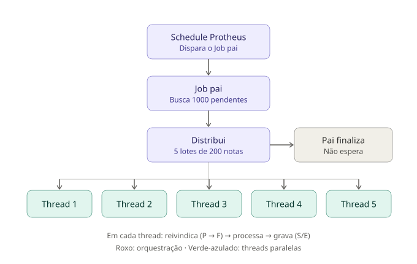
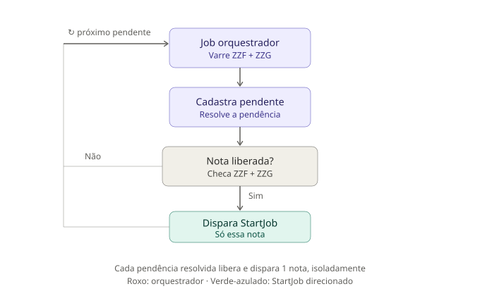

# Proposta de arquitetura — Loop interno + distribuição paralela nos Jobs FATZZ*

## Contexto

Volume atual: ~5.000 notas/dia entre todos os tipos, distribuídas ao
longo do expediente (sem picos concentrados, confirmado — não há carga
de notas durante conversas com cliente em horário comercial).

Dois problemas observados na operação atual:
1. **Overhead de abertura repetido**: com fila vazia, o Schedule dispara
   o Job a cada ~5-6s (observado no `FATZZD01`, 18/08), pagando o custo
   de `RpcSetEnv`+query a cada disparo, mesmo sem nada pra processar.
2. **Processamento sequencial**: mesmo com fila cheia, uma nota por vez,
   ~6-8s/nota (medido em produção). Volume atual não torna isso um
   gargalo de capacidade (~5.000 × 7s ≈ 9h de processamento total,
   distribuído ao longo de um expediente bem maior que isso) — mas é uma
   oportunidade de reduzir latência por nota se o volume crescer.

---

## Proposta 1 — Loop interno no fonte (baixo risco)

Em vez de o Job sair depois de processar uma leva e esperar o próximo
disparo do Schedule, o próprio fonte reconsulta a fila internamente:
processa a leva atual, roda a query de novo, processa de novo — só sai
do programa quando a query retornar zero linhas.

**Vantagens**:
- Elimina o overhead de reabertura de ambiente nos picos de fila cheia
  (paga o custo de abertura uma vez por "sessão de trabalho", não uma
  vez por disparo).
- **Continua rodando numa thread só** — não introduz nenhum risco de
  concorrência novo. A proteção nativa do Schedule contra sobreposição
  (confirmada via documentação oficial TDN — catch-up sequencial é
  garantido pelo motor) continua valendo sem precisar de nenhuma trava
  adicional.

**Risco a mitigar — válvula de escape obrigatória**: sem limite, e com
fluxo de chegada teoricamente maior ou igual à taxa de processamento em
algum cenário atípico (reintegração de backlog, pico fora do padrão), o
loop pode nunca ver zero linhas e o Job nunca devolve controle pro
Schedule. Consequências: atualização de código não pega enquanto ele não
sair, e execução muito longa sem checkpoint fica difícil de diagnosticar
("está ocupado" vs "travou").

**Mitigação**: limite de tempo (ex.: sai depois de X minutos rodando,
mesmo com fila) ou de quantidade (ex.: sai depois de processar N notas),
o que vier primeiro. Valor exato de X/N a definir — não é crítico com o
volume atual, mas não custa ter.

---

## Proposta 2 — Distribuição paralela via `StartJob` (risco moderado, ganho de latência)



Query principal traz até 1.000 notas pendentes; distribui em 5 lotes de
200, cada lote disparado como uma thread independente via `StartJob()`
— até 5 threads simultâneas por rodada.

**Por que a divisão em lote fixo, feita antes de disparar as threads, é
importante**: cada thread já recebe sua lista de códigos pronta — nenhuma
thread faz `SELECT` própria pra decidir o que processar, então não há
disputa por "quais linhas pegar" entre as 5 (esse é o principal risco de
corrida que multi-thread genérico teria, e essa abordagem evita por
construção).

### Status novo: `'F'` (Em Fila/Andamento paralelo)

Diferencia "sendo processado de verdade agora, por uma thread ativa" de
`'A'` (hoje usado como sinal de recuperação de Job travado). Sem essa
distinção, uma nota sendo processada de verdade por uma thread poderia
ser "recuperada" por engano por outra consulta.

**Requer campo novo**: timestamp de início de processamento (não existe
hoje — `DTPROC`/`HRPROC` só gravam no fim, sucesso ou erro). Necessário
pra decidir, por tempo parado, se um `'F'` é processamento ativo ou
órfão de crash:
```sql
WHERE STATUS = 'P' 
   OR (STATUS = 'F' AND <tempo desde inicio> > <tolerância>)
```

### Decisão em aberto — Job pai espera as 5 threads ou dispara e sai?

**Decisão preliminar do Zé Carlos: não espera** (dispara as 5 e sai
imediatamente). Justificativa: licenciamento CAASP é corporativo, sem
limite por conexão — o motivo mais comum pra preferir "esperar" (economia
de licença) não se aplica aqui.

**Consequência que precisa de solução antes de implementar**: sem o pai
esperar, "5 threads" descreve só quantas essa rodada específica lança —
não quantas estão rodando **no total**, a qualquer momento. Se o próximo
disparo do Schedule ocorrer antes das 5 threads da rodada anterior
terminarem de esvaziar seus 200 cada (a ~6,5s/nota, ~22min por lote de
200), a rodada nova lança mais 5 — empilhando. Sem trava de licença
barrando isso, o número real de threads simultâneas pode crescer sem
limite ao longo do dia.

**Por que isso importa mesmo sem limite de licença**: o gargalo pode
migrar pro **banco Oracle** — muitas threads batendo simultaneamente na
mesma checagem de duplicidade/numeração contra `SF2` pode gerar
contenção real (espera de lock), anulando o ganho de paralelizar.

**Duas opções pra fechar o cap de verdade, a decidir**:
1. **Contador global de threads ativas** (tabela de controle dedicada,
   ou mecanismo `IPCGO`/memória compartilhada do framework AdvPL — ver
   material de referência abaixo): cada thread nova consulta "quantas
   estão rodando agora?" antes de disparar; se já tem 5, não dispara mais
   nesta rodada, deixa o resto pra próxima tentativa.
2. **Aceitar que "5" é só um teto por rodada, não um teto global**, e
   confiar que o intervalo real do Schedule (a confirmar — vimos ~5-6s
   com fila vazia, mas não sabemos o intervalo real com fila cheia) é
   espaçado o suficiente pra não empilhar na prática. Mais simples, mais
   arriscado.

---

## Proposta 3 — Job orquestrador dedicado pra pendências (cliente/fornecedor/produto)



Job separado das Propostas 1/2, dedicado só a registros com pendência
(`ZZF`/produto, `ZZG`/cliente-fornecedor). Em vez de esperar o próximo
ciclo normal do Job de destino (`FATZZA01`/`B01`/`C01`/`D01`) pra pegar
uma nota recém-liberada, esse orquestrador:

1. Varre `ZZF`/`ZZG` por pendências.
2. Cadastra o pendente (produto via `ZZF_CADPRD`, cliente/fornecedor via
   `PI_CLI_X`/`PI_FORN_X`).
3. Checa se a nota associada ficou sem **nenhuma** pendência (via
   `U_ZZPENDOK`, que já cruza `ZZF` e `ZZG` juntas).
4. Se ainda sobrar pendência (ex.: produto resolvido, cliente ainda não):
   segue pro próximo registro, sem disparar nada.
5. Se a nota ficou livre: dispara um `StartJob()` **direcionado** — só
   pra processar aquela nota específica (por `cCod`/chave) — e segue pro
   próximo pendente.

**Diferença importante em relação à Proposta 2**: aqui não há disputa por
`SELECT` de lote entre threads — cada `StartJob` mira uma nota já
identificada, individualmente. O orquestrador em si roda sequencial (um
pendente de cada vez), só o processamento da nota liberada é assíncrono.

**Risco que ainda existe, mesmo assim**: a nota liberada por esse
orquestrador pode colidir com o **ciclo normal** do Job de destino
pegando a mesma nota ao mesmo tempo (ela volta pro `STATUS='P'`, visível
pros dois caminhos). O claim atômico de linha (já necessário pra
Proposta 2) protege esse cenário também — não é uma proteção adicional
separada, é a mesma peça resolvendo os dois riscos.

**Ganho real depende do intervalo do Job de destino**: se o ciclo normal
já é curto (~5-6s, como observado com fila vazia), o `StartJob`
direcionado economiza pouco — a nota seria pega no próximo ciclo em
poucos segundos de qualquer jeito. Se o intervalo real for mais espaçado
(minutos/horas), o ganho de latência fica bem mais relevante.

---

## Riscos que já existem independente da decisão acima (levar pra discussão)

- **Claim atômico de linha**: cada thread precisa reivindicar sua fatia
  via `UPDATE` condicional checando linhas afetadas (não confirmado ainda
  como obter isso via `TCSqlExec` em AdvPL — ver pendência técnica).
- **Duplicidade de cadastro cliente/fornecedor**: se duas threads
  processarem, ao mesmo tempo, notas diferentes que precisam do mesmo
  CNPJ novo, `CheckLeg` (checagem atual) não impede a corrida — risco de
  criar `SA1`/`SA2` duplicado.

## Material de referência já levantado

- Classe `FWGridProcess` (framework AdvPL) — candidata a resolver
  distribuição de trabalho/claim atômico nativamente, em vez de
  implementar na mão. Documentação da TDN não foi possível consultar
  ainda (bloqueio de acesso) — pendente alguém com login TDN ou contato
  que já tenha usado.
- Repositório de treinamento:
  github.com/charlesreitz/advpl-treinamento-multithread (cobre
  `FWGridProcess`/`StartJOB`/`IPCGO`/`GRIDServer`/`ManualJob`).
- Documentação oficial do Schedule Protheus (TDN) confirma catch-up
  sequencial de agendamentos atrasados por design do motor — não é
  suposição, é comportamento documentado.

---

## Resumo pra decisão da sala

| Item | Status |
|---|---|
| Loop interno (Proposta 1) | Baixo risco, recomendado — só falta definir o limite de tempo/quantidade da válvula de escape |
| Distribuição via `StartJob` (Proposta 2) | Ganho de latência, não de capacidade (volume atual não exige) — risco moderado, decisão do cap global ainda em aberto |
| Orquestrador de pendências (Proposta 3) | Mais seguro que a Proposta 2 (sem disputa de `SELECT`), mas ganho depende do intervalo real do Job de destino — avaliar junto |
| Pai espera ou não espera as threads (Proposta 2) | Inclinação: não espera (licença corporativa) — mas exige resolver o cap global antes de implementar |
| Status `'F'` + timestamp de início | Necessário se Proposta 2 avançar, independente da decisão de esperar |
